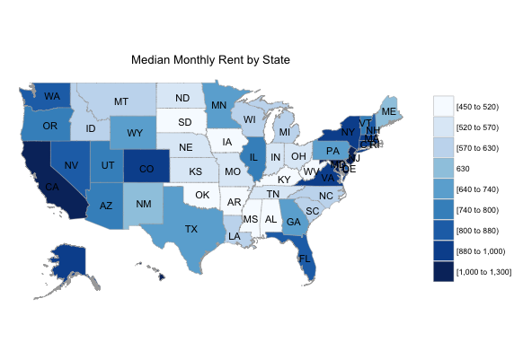
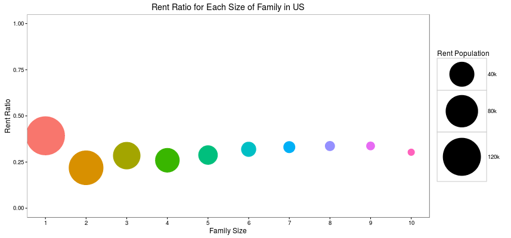

# Is He Going to Buy or Rent? 
*#-- A practical tool for real estate agent.*

It's always a nice thing for real estate agents to know client's intention in advance. If they do, they can use the advantage to do a better sales.So, we try to develop a tool for real estate agent to make a decision on whether the client is going to buy or rent a house.


## Elements Correlated to Rent Ratio

###Region
Actual Rent Ratio v.s. Expected Rent Trends
We expect that the higher the relative house price(house price/rent cost) in a state, the more likely people in that state tend to rent.

```{r setup, include=FALSE}
knitr::opts_chunk$set(echo = TRUE)
```
[Rent Ratio Map](https://rong.shinyapps.io/deviation_from_economic_decision/)        


###Family Size
Does larger family tend to buy a house instead of renting?

[Family Size](https://rong.shinyapps.io/family/)      
   


###Married Status
Do married people rent less than single ones?      
Do the younger rent more than the older? 

[Personal Status](https://rong.shinyapps.io/married/)      
       

###Class of Work
What influence do different class of work have on people's rent/buy strategy?

[Industry](https://rong.shinyapps.io/class_of_work/)      
       

###Race
Maybe some cultures are most reluctant to rent?

[Race](https://rong.shinyapps.io/race/)     
       


###Final Tool
It's a tool for real estate agent to make decisions. Time series of rent ratio for the specific group will be displayed.

[Tool](https://rong.shinyapps.io/tool/)       
       


    