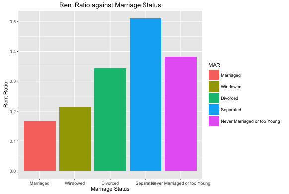

# Is He Going to Buy or Rent? -- A practical tool for real estate agent.


## Actual Rent Ratio v.s. Expected Rent Trends
We expect that the higher the relative house price(house price/rent cost) in a state, the more likely people in that state tend to rent.
But is it true?
```{r setup, include=FALSE}
knitr::opts_chunk$set(echo = TRUE)
```
[Rent Ratio Map](https://rong.shinyapps.io/deviation_from_economic_decision/)        


## Elements Correlated to Rent Ratio
Do married people rent less than single ones?      
Do the younger rent more than the older? 

[Personal Status](https://rong.shinyapps.io/married/)      
       

What influence do different industries have on people's rent/buy strategy?

[Industry](https://rong.shinyapps.io/class_of_work/)     


Does larger family tend to buy a house instead of renting?

[Family Size](https://rong.shinyapps.io/family/)      


Maybe some cultures are most reluctant to rent?

[Race](https://rong.shinyapps.io/race/)      


## So ... will she rent or buy? 
[Tool](https://rong.shinyapps.io/tool/)     


    